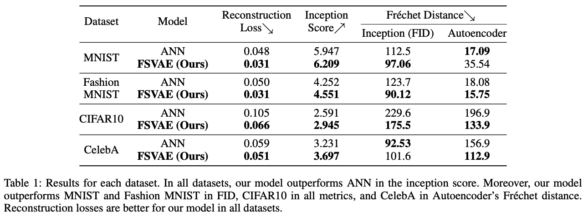
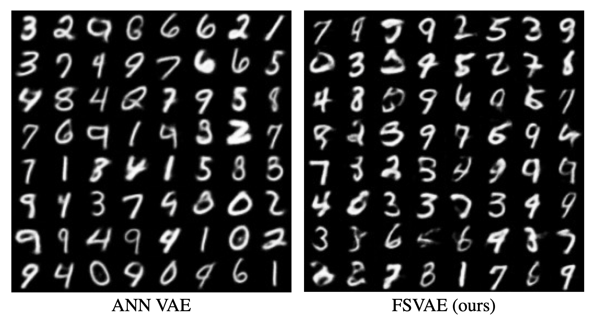
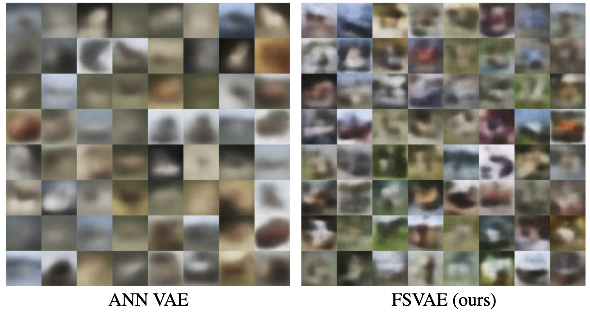
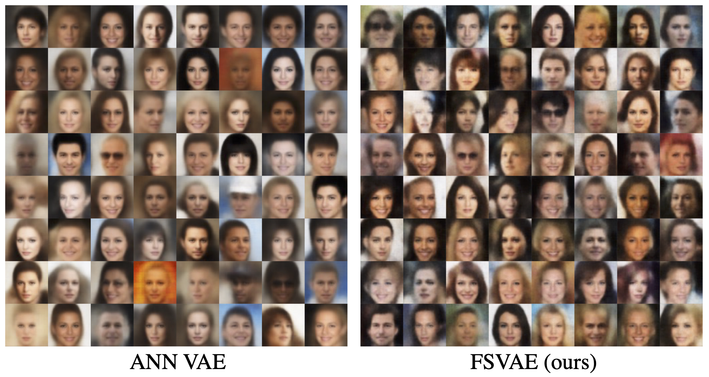
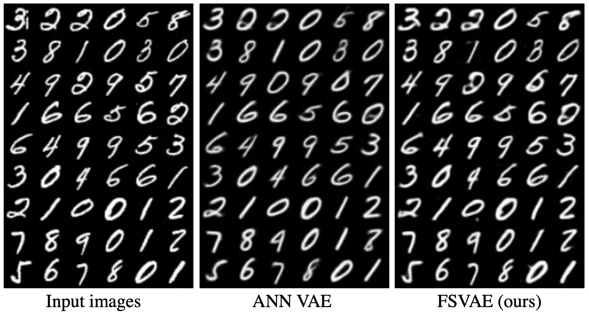
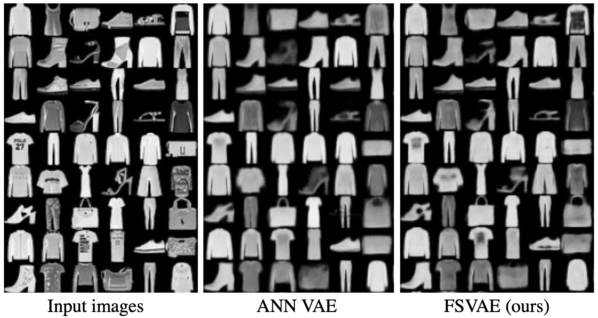
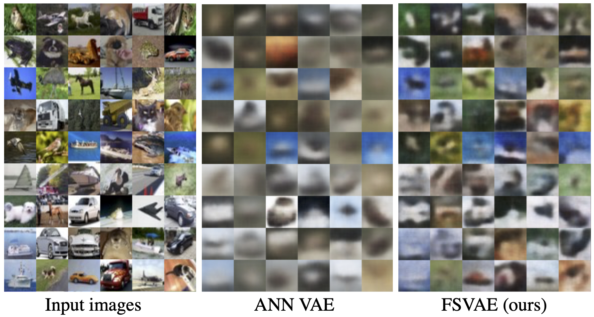
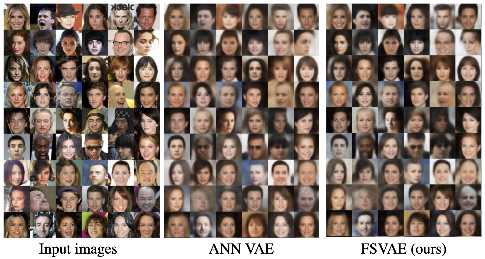

# Fully Spiking Variational Autoencoder
official implementation of Fully Spiking Variational Autoencoder (FSVAE) 

arxiv: https://arxiv.org/abs/2110.00375


# Get started

1. install dependencies

```
pip install -r requirements.txt
```

2. initialize the fid stats

```
python init_fid_stats.py
```

# Demo
The following command calculates the Inception score & FID of FSVAE trained on CelebA. After that, it outputs `demo_input.png`, `demo_recons.png`, and `demo_sample.png`.
```
python demo.py
```

# Training Fully Spiking VAE
```
python main_fsvae exp_name -config NetworkConfigs/dataset_name.yaml
```

Training settings are defined in `NetworkConfigs/*.yaml`.

args:
- name: [required] experiment name
- config: [required] config file path
- checkpoint: checkpoint path (if use pretrained model) 
- device: device id of gpu, default 0

# Training ANN VAE
As a comparison method, we prepared vanilla VAEs of the same network architecture built with ANN, and trained on the same settings.

```
python main_ann_vae exp_name -dataset dataset_name
```

args: 
- name: [required] experiment name
- dataset:[required] dataset name [mnist, fashion, celeba, cifar10]
- batch_size: default 250
- latent_dim: default 128
- checkpoint: checkpoint path (if use pretrained model) 
- device: device id of gpu, default 0

# Evaluation


# Generated Images





# Reconstructed Images




